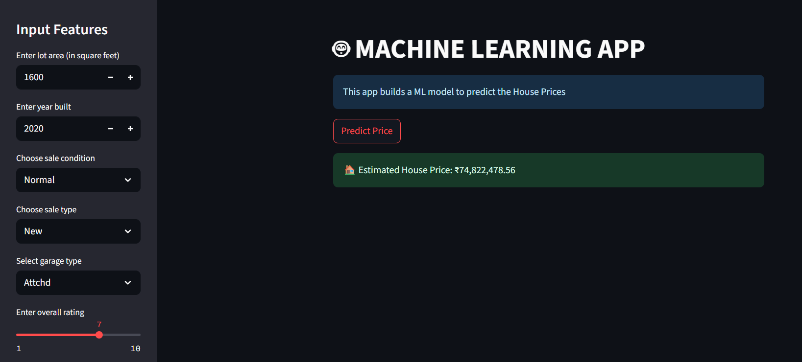

# 🏠 House Price Prediction Web App
This project uses a Linear Regression model to predict house prices based on selected features such as LotArea, SaleCondition, SaleType, OverallQual, YearBuilt, and GarageType.
It has been deployed as an interactive Streamlit web app.

## 🔍 Overview

🎯 Goal: Predict house prices using user-provided metrics.

🤖 Model Used: Linear Regression.  

🌐 framework : Streamlit - used to create a interactive and responsive web app.   

🧠 Backend/ML: Python, Scikit-learn.  

📊 Dataset: [Ames House Prices](https://www.kaggle.com/competitions/house-prices-advanced-regression-techniques/data) Dataset

## 🚀 Live Demo 

🔗[live demo link click here](https://housepricepredictorsimple.streamlit.app/)

## 📌 How it Works
1. User enters input for house parameters.

2. Categorical variables are encoded using the saved encoder.pkl.

3. The trained model LR_HPP.pkl predicts the house price.

4. Result is displayed with optional plots/visuals.

## 📷 Screenshots

## 📌 Project Highlights
- [x] Exploratory Data Analysis (EDA)
- [x] Data Preprocessing
- [x] Feature Selection
- [x] Model Training (Linear Regression)
- [x] Model Evaluation (MAE, RMSE, R²)
- [x] Streamlit Web Application
- [x] Deployment  

## 📔 Model Summary
- Model Used: Linear Regression

- Features Used:
LotArea, SaleCondition, SaleType, OverallQual, YearBuilt, GarageType

## 📈 Model Performance/Evaluation Metrics

| Metric | Score       |
| ------ | ----------- |
| MAE    | 18,612      |
| MSE    | 876,261,511 |
| R²     | 0.886       |

## 🙋‍♂️ Author
Sridhar Sahu

First ML project with deployment. Exploring the intersection of ML and web development.

• [portfolio](https://github.com/sahusridhar23) 
